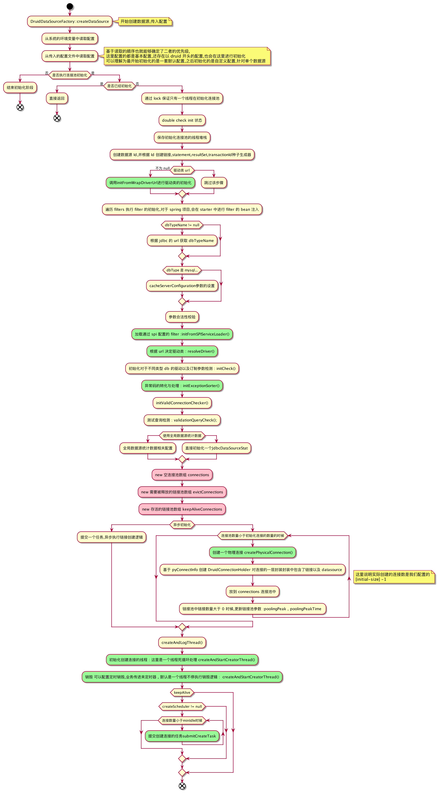

# Druid 学习

## 一. 项目配置

## 1.1 拉取项目代码

```shell
git clone git@github.com:alibaba/druid.git
```

## 1.2 本地编译执行

- 这里因为在 pom 依赖中Druid 配置了 jdk 路径`env.JAVA_HOME`,对于没有初始化本地环境变量的同学这里可能会报错,可以通过配置 jdk 路径来解决 : 

```xml
	<properties>
		<env.JAVA_HOME>/***/JDk/Home</env.JAVA_HOME>
	</properties>
```

- 打包项目

```shell
mvn clean install
```


## 1.3 开发测试 demo 1.0

- 这里因为是测试,所以我使用了 H2 数据库

```xml
				<dependency>
            <groupId>com.h2database</groupId>
            <artifactId>h2</artifactId>
            <scope>runtime</scope>
        </dependency>
```

- 使用示例 : 下面的这个 demo 很简单就是通过 DataSource创建了一个数据源,之后根据数据源获取链接,进行一些 CRUD 操作.

```java
import com.alibaba.druid.pool.DruidDataSourceFactory;
import lombok.extern.slf4j.Slf4j;

import javax.sql.DataSource;
import java.sql.Connection;
import java.sql.PreparedStatement;
import java.sql.ResultSet;
import java.util.Properties;

....
  
 
	public static void main(String[] args) throws Exception {
        Properties properties = new Properties();
        properties.setProperty("url", "jdbc:h2:mem:foo");
        DataSource dataSource = DruidDataSourceFactory.createDataSource(properties);
        Connection connection = dataSource.getConnection();
        PreparedStatement preparedStatement = connection.prepareStatement("CREATE TABLE FOO (ID INT IDENTITY, BAR VARCHAR(64))");
        preparedStatement.execute();
        preparedStatement = connection.prepareStatement("INSERT INTO FOO (ID, BAR) VALUES (1, 'aaa')");
        int updateCount = preparedStatement.executeUpdate();
        preparedStatement = connection.prepareStatement("SELECT * FROM FOO");
        ResultSet resultSet = preparedStatement.executeQuery();
        if (resultSet.next()) {
            String id = resultSet.getString("id");
            String value = resultSet.getString("bar");
            log.info("select result info is : " + id + " - " + value);
        }
        connection.close();
    }
```

## 1.4 开发测试 demo 2.0

- 接下来我们可以尝试使用 Druid 的高级特性,这里因为Druid 的监控是内置的,所以我新建了一个 web 项目,并且对于 Druid 的使用借助了 starter
- 源码地址 : git@github.com:YczYanchengzhe/druidStudy.git
**application.properties 配置**

```text
# 控制 actuator 的端点信息
management.endpoints.web.exposure.include=*
# 控制台彩色输出
spring.output.ansi.enabled=ALWAYS

# 数据源连接
spring.datasource.url=jdbc:h2:mem:testdb
# 用户名
spring.datasource.username=sa
# 密码
spring.datasource.password=
# 对于内嵌数据库,初始化相关操作
# 初始化模式 : embedded|always|never
spring.datasource.initialization-mode=always

spring.datasource.druid.initial-size=2
spring.datasource.druid.max-active=2
spring.datasource.druid.min-idle=2
# 过滤器
spring.datasource.druid.filter.config.enabled=true
spring.datasource.druid.filters=config,stat,slf4j,conn

spring.datasource.druid.connection-properties=config.decrypt=true
spring.datasource.druid.test-on-borrow=true
spring.datasource.druid.test-on-return=true
spring.datasource.druid.test-while-idle=true
```

**filter 配置** : 配置路径结构为 : resources/META-INF/druid-filter.properties

```text
druid.filters.conn=ConnectionLogFilter
```

**Filter 实现** : 这里的实现是在创建和关闭链接前后打印一条日志

```java
@Slf4j
public class ConnectionLogFilter extends FilterEventAdapter {
	@Override
	public void connection_connectBefore(FilterChain chain, Properties info) {
		log.info("Before connect !");
	}

	@Override
	public void connection_connectAfter(ConnectionProxy connection) {
		log.info("after connect !");
	}
}
```

# 二. 源码阅读

## 2.1 数据源初始化配置
- 下面我们从上面的 demo 入手,开始进行源码的剖析,首先就是数据源的创建
```java
DataSource dataSource = DruidDataSourceFactory.createDataSource(properties);
```
- 初始化配置
```java
    configFromPropety(Properties properties);
    ...
    config(dataSource, properties);
 ```

- 在初始化配置时候,可以通过配置决定是否要加载连接池
```java
        if ("true".equals(value)) {
            dataSource.init();
        }
```

- 在 init 方法中首先会进行数据源 id 以及链接 id 等相关id 的种子生成

```java
            this.id = DruidDriver.createDataSourceId();
            if (this.id > 1) {
                long delta = (this.id - 1) * 100000;
                connectionIdSeedUpdater.addAndGet(this, delta);
                statementIdSeedUpdater.addAndGet(this, delta);
                resultSetIdSeedUpdater.addAndGet(this, delta);
                transactionIdSeedUpdater.addAndGet(this, delta);
            }
```
- 紧接着进行 jdbc 驱动类的识别
```java
initFromWrapDriverUrl();
```
- 初始化 filter , 加载 spi 的 filter

```java
            // 初始化 filter , 加密 ,监控等 都是 filter
            for (Filter filter : filters) {
                filter.init(this);
            }
            ...
            initFromSPIServiceLoader();
```
- 根据 url 决定驱动类
```java
  resolveDriver();
```

- 异常码的转化与处理
```java
 initExceptionSorter();
```

- 进行检测相关操作

```java
 initValidConnectionChecker();
// 测试查询检测
 validationQueryCheck();
```

- 连接池初始化

```java
            // 连接池 存储的是全部连接
            connections = new DruidConnectionHolder[maxActive];
            // 存储的是需要被释放的链接
            evictConnections = new DruidConnectionHolder[maxActive];
            // 存活的链接
            keepAliveConnections = new DruidConnectionHolder[maxActive];
```


- 对于连接池中连接的初始化,这里可以选择同步或者异步

```java
if (createScheduler != null && asyncInit)
        submitCreateTask(true);
else
   // 创建物理连接
   PhysicalConnectionInfo pyConnectInfo = createPhysicalConnection();
   // holder 用于管理连接池
   DruidConnectionHolder holder = new DruidConnectionHolder(this, pyConnectInfo);
   // 丢到池子中
   connections[poolingCount++] = holder;
```
- 初始化创建连接的线程 : 这里是一个线程死循环处理
```java
createAndStartCreatorThread();
```
- 销毁 可以配置定时销毁,业务传进来定时器 , 默认是一个线程不停执行销毁逻辑
```java
createAndStartDestroyThread();
```

- 完成创建操作


- 整体流程图如下


