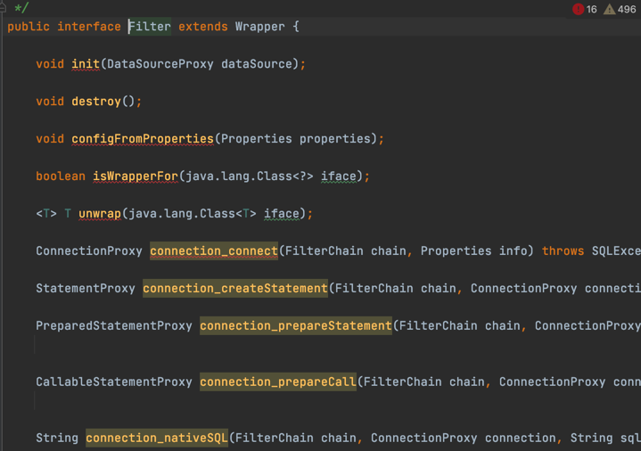
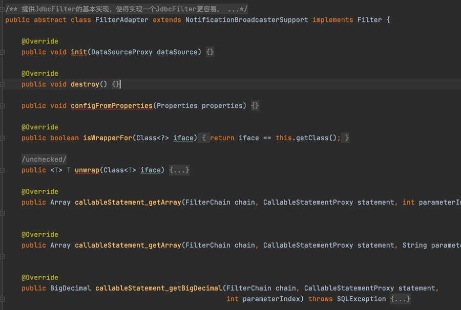
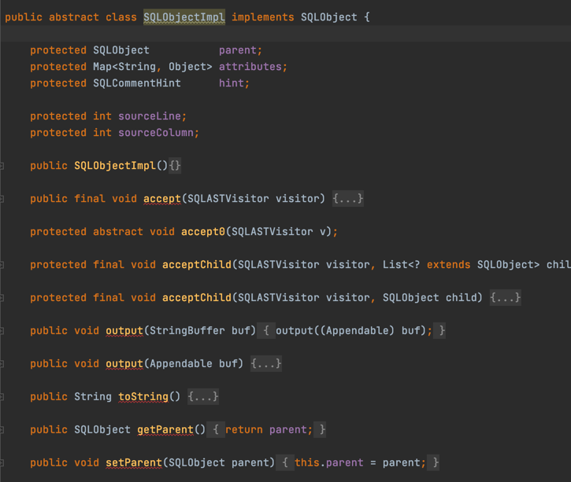
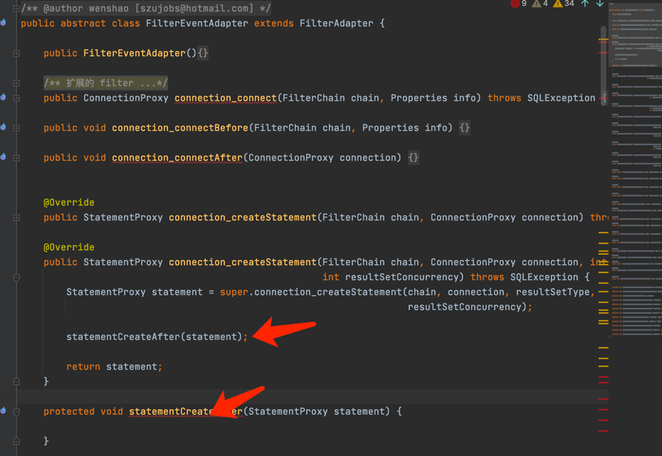
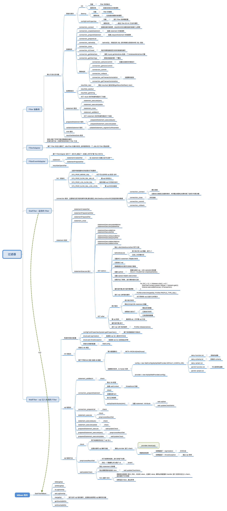
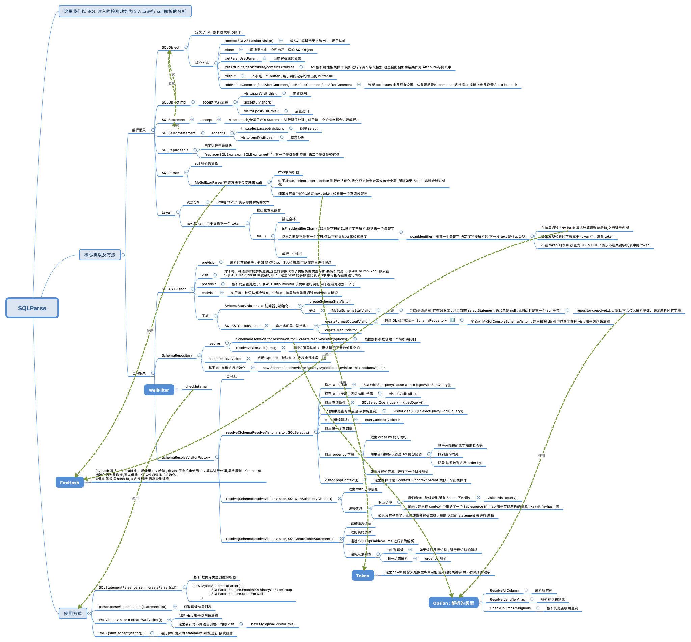

# 设计总结

## 一. Filter 和 SQLParse 

### 1. 对于 Filter 和 SQLParse ,首先都会先抽象出一个公有的父类进行行为的抽象

### 2. 基于 filter 的所有抽象,进行一个基本实现,为了方便后面的扩展

### 3. 当需要添加新功能时候,在原接口基础上增加新的接口,进行扩展

## 二. Filter 处理脑图

## 三. SQL 解析处理 脑图

