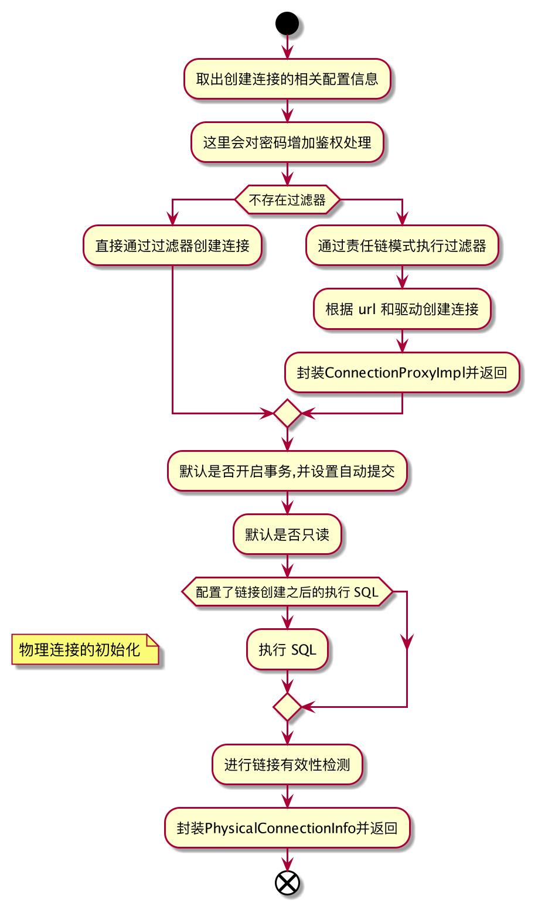
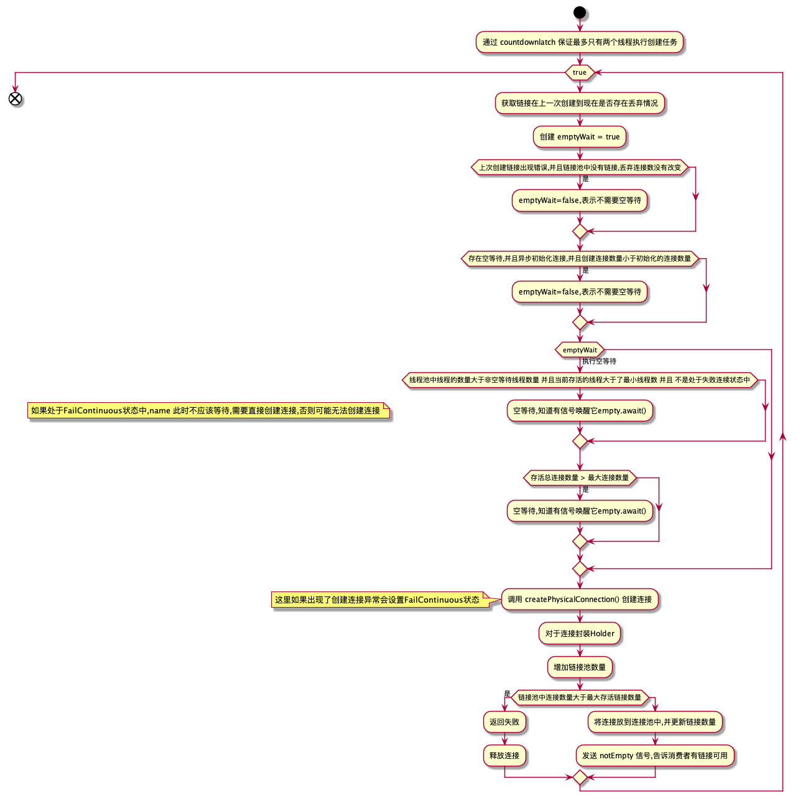
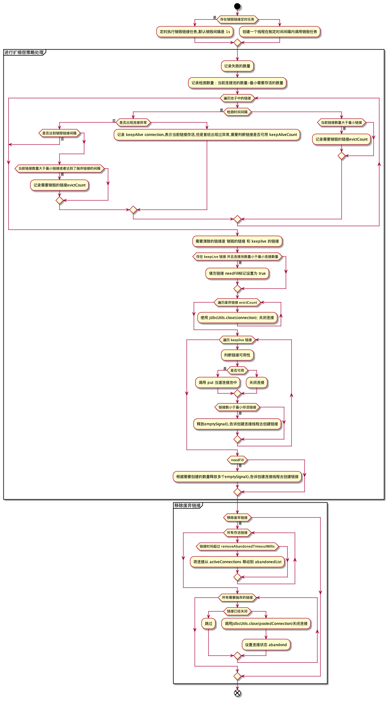

# 连接池初始化相关细节

## 一. 针对数据源初始化过程中涉及到的一些步骤进行分析

- filter 的加载与初始化 : initFromSPIServiceLoader()
```text
1. 对于使用非 starter 项目,需要对 spi 的 filter 增加 @AutoLoad注解才会生效
2. 对于 spring starter 接入的项目,只需要配置 spi 就会被自动添加进来.
```

- 根据 URL 决定驱动类 : resolveDriver()

```text
这里是通过驱动类的前缀进行判断,决定当前 jdbc 使用的驱动类型.
```

- 对于异常链接的处理 : initExceptionSorter() 关于 ExceptionSorter [参考](https://github.com/alibaba/druid/wiki/ExceptionSorter_cn)
```text
ExceptionSorter 是连接池稳定性考量的一个重要指标.其代表的含义是在出现网络抖动或者数据库不可用时候,该链接是否会被自动摘除,保证链接池的可用性不受影响
这一步的初始化操作,做的事情就是针对不同的 jdbc 驱动,对应的数据库当出现网络异常时候,会返回不同的状态码,这里进行不同模式下状态码的初始化,以便sql 出现异常之后判断是否是服务端挂掉或者网络有问题导致.
```

- 创建物理连接 : createPhysicalConnection()


- 额外线程创建连接 : createAndStartCreatorThread()
  

- 额外线程销毁链接 : createAndStartDestroyThread()
  


