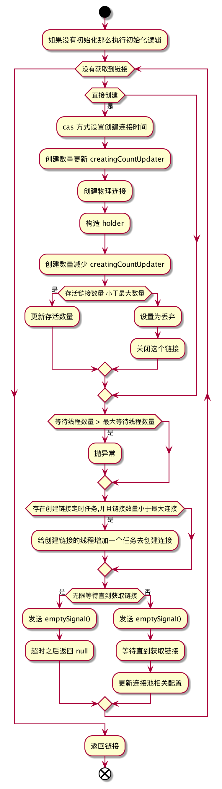
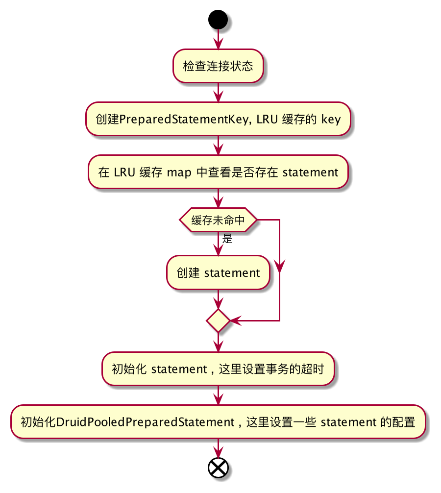
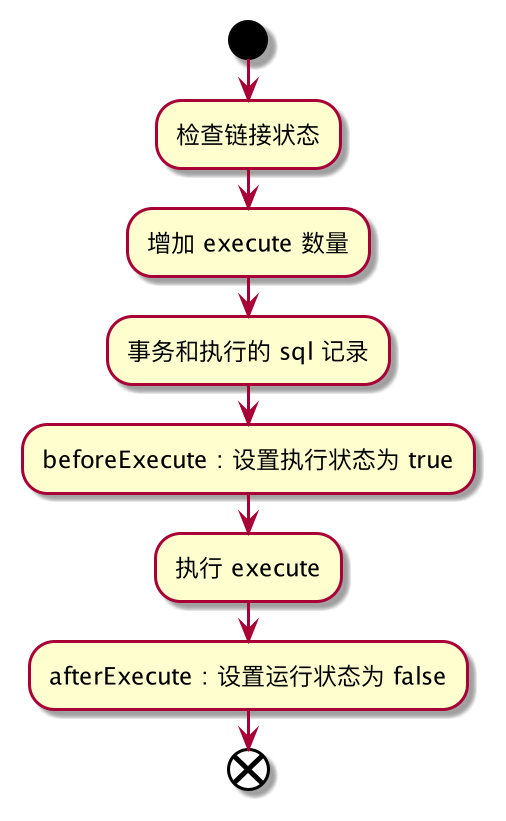
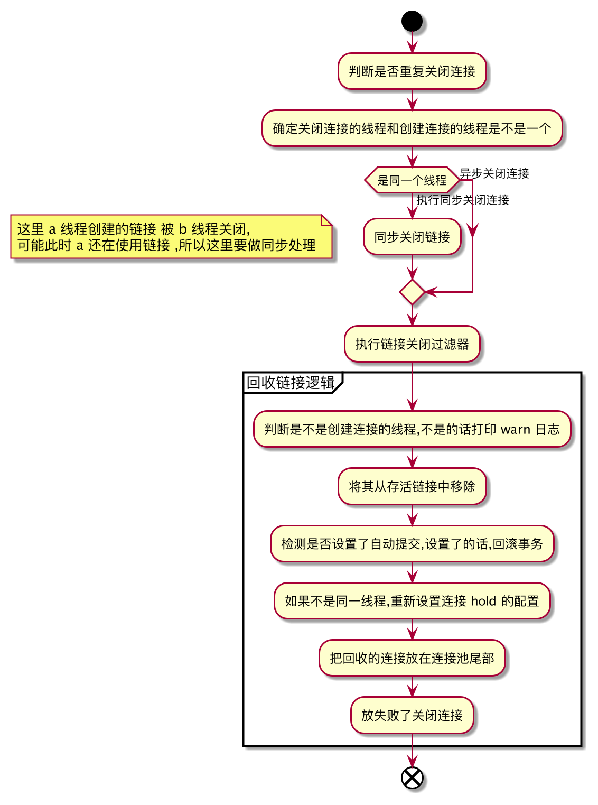

## 一. 获取链接 ,SQL 预处理 , SQL 执行 , 链接关闭流程

- 获取链接 : 先执行获取链接的 filter , 在 filter 的最后会调用直接获取链接

```java
        if(filters.size()>0){
        FilterChainImpl filterChain=new FilterChainImpl(this);
        return filterChain.dataSource_connect(this,maxWaitMillis);
        }else{
        return getConnectionDirect(maxWaitMillis);
        }
```



- preparement , sql 预编译



- execute : sql 执行



- statement 关闭,释放资源
  .png)

- connection 关闭,放回连接池
  

