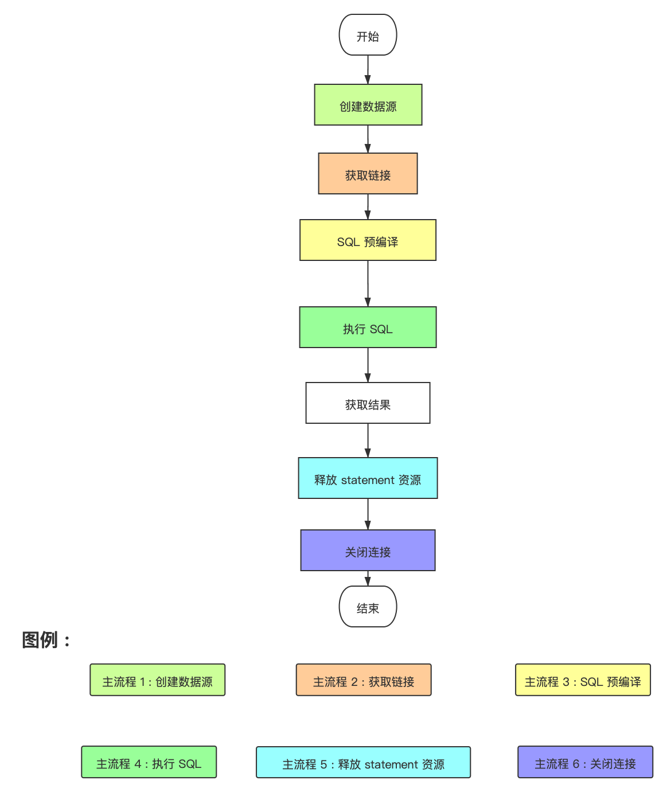

# 整体流程

## 流程概述


| 流程编号    | 功能概述 |
| ----------- | -------- |
| **主流程1** | 创建数据源 |
| **主流程2** | 获取链接 |
| **主流程3** | SQL 预编译 |
| **主流程4** | 执行 SQL |
| **主流程5** | 释放 statement 资源 |
| **主流程6** | 关闭连接 |


## 流程图



## 解析

## 代码

```java
    public static void main(String[] args) throws Exception {
        Properties properties = new Properties();
        properties.setProperty("url", "jdbc:h2:mem:foo");
        properties.setProperty("filters", "config,stat,slf4j,conn");
        // 创建数据源
        DataSource dataSource = DruidDataSourceFactory.createDataSource(properties);
        // 获取链接
        Connection connection = dataSource.getConnection();
        // sql 预编译
        PreparedStatement preparedStatement = connection.prepareStatement("CREATE TABLE FOO (ID INT IDENTITY, BAR VARCHAR(64))");
        // 执行 sql
        preparedStatement.execute();
        preparedStatement = connection.prepareStatement("INSERT INTO FOO (ID, BAR) VALUES (1, 'aaa')");
        int updateCount = preparedStatement.executeUpdate();
        preparedStatement = connection.prepareStatement("SELECT * FROM FOO");
        ResultSet resultSet = preparedStatement.executeQuery();
        if (resultSet.next()) {
            String id = resultSet.getString("id");
            String value = resultSet.getString("bar");
            log.info("select result info is : " + id + " - " + value);
        }
        // 释放 statement 资源
        preparedStatement.close();
        // 释放连接资源
        connection.close();
    }
```

# 主流程 2 : 获取链接

- 过滤器链的实现
```java
    public ConnectionProxy connection_connect(Properties info) throws SQLException {
        /*
            这个是递归,借助递归进行的 filter 调用
            并且通过 pos 指向执行到了哪个过滤器
         */
        if (this.pos < filterSize) {
            // nextFilter 就是将 pos 指向当前 filter 的下一个
            return nextFilter()
                    .connection_connect(this, info);
        }

        Driver driver = dataSource.getRawDriver();
        String url = dataSource.getRawJdbcUrl();
        // 调用 jdbc 的接口 去创建连接 
        Connection nativeConnection = driver.connect(url, info);

        if (nativeConnection == null) {
            return null;
        }

        return new ConnectionProxyImpl(dataSource, nativeConnection, info, dataSource.createConnectionId());
    }
```


```java
    /**
     *  获取链接
     * @param maxWaitMillis
     * @return
     * @throws SQLException
     */
    public DruidPooledConnection getConnectionDirect(long maxWaitMillis) throws SQLException {
        int notFullTimeoutRetryCnt = 0;
        for (;;) {
            // handle notFullTimeoutRetry
            DruidPooledConnection poolableConnection;
            try {
                poolableConnection = getConnectionInternal(maxWaitMillis);
            } catch (GetConnectionTimeoutException ex) {
                if (notFullTimeoutRetryCnt <= this.notFullTimeoutRetryCount && !isFull()) {
                    notFullTimeoutRetryCnt++;
                    if (LOG.isWarnEnabled()) {
                        LOG.warn("get connection timeout retry : " + notFullTimeoutRetryCnt);
                    }
                    continue;
                }
                throw ex;
            }
            // 判断 testOnBorrow 参数
            if (testOnBorrow) {
                boolean validate = testConnectionInternal(poolableConnection.holder, poolableConnection.conn);
                if (!validate) {
                    if (LOG.isDebugEnabled()) {
                        LOG.debug("skip not validate connection.");
                    }

                    discardConnection(poolableConnection.holder);
                    continue;
                }
            } else {
                if (poolableConnection.conn.isClosed()) {
                    discardConnection(poolableConnection.holder); // 传入null，避免重复关闭
                    continue;
                }

                if (testWhileIdle) {
                    final DruidConnectionHolder holder = poolableConnection.holder;
                    long currentTimeMillis             = System.currentTimeMillis();
                    long lastActiveTimeMillis          = holder.lastActiveTimeMillis;
                    long lastExecTimeMillis            = holder.lastExecTimeMillis;
                    long lastKeepTimeMillis            = holder.lastKeepTimeMillis;
                    // 如果启用了checkExecuteTime参数,并且上一次 active 时间和 exectime 不相同,按照 exec 时间为准来判断是否进行链接可用性检测
                    if (checkExecuteTime
                            && lastExecTimeMillis != lastActiveTimeMillis) {
                        lastActiveTimeMillis = lastExecTimeMillis;
                    }
                    // 如果上一次检测时间在 active time 之后,以上一次检测时间为准
                    if (lastKeepTimeMillis > lastActiveTimeMillis) {
                        lastActiveTimeMillis = lastKeepTimeMillis;
                    }
                    // 获取该链接未被使用的 ms 时间
                    long idleMillis                    = currentTimeMillis - lastActiveTimeMillis;

                    long timeBetweenEvictionRunsMillis = this.timeBetweenEvictionRunsMillis;
                    // 如果没有配置,默认 1min 探活一次
                    if (timeBetweenEvictionRunsMillis <= 0) {
                        timeBetweenEvictionRunsMillis = DEFAULT_TIME_BETWEEN_EVICTION_RUNS_MILLIS;
                    }
                    // 如果连接未使用的时间间隔大于了timeBetweenEvictionRunsMillis,执行 testConnectionInternal
                    if (idleMillis >= timeBetweenEvictionRunsMillis
                            || idleMillis < 0 // unexcepted branch
                            ) {
                        boolean validate = testConnectionInternal(poolableConnection.holder, poolableConnection.conn);
                        if (!validate) {
                            if (LOG.isDebugEnabled()) {
                                LOG.debug("skip not validate connection.");
                            }

                            discardConnection(poolableConnection.holder);
                             continue;
                        }
                    }
                }
            }
            // 是否移除废弃链接, 可配置
            if (removeAbandoned) {
                StackTraceElement[] stackTrace = Thread.currentThread().getStackTrace();
                poolableConnection.connectStackTrace = stackTrace;
                poolableConnection.setConnectedTimeNano();
                poolableConnection.traceEnable = true;

                activeConnectionLock.lock();
                try {
                    /*
                         将其放入到 activeConnections中, 这里只是将连接放进去 ,
                         当进行链接回收的时候,如果需要回收的是该链接,会在activeConnections中找该链接,进行链接的回收操作
                     */
                    activeConnections.put(poolableConnection, PRESENT);
                } finally {
                    activeConnectionLock.unlock();
                }
            }
            // 如果默认是非自动提交,那么设置连接的自动提交为 false
            if (!this.defaultAutoCommit) {
                poolableConnection.setAutoCommit(false);
            }

            return poolableConnection;
        }
    }
```

# 主流程 3 : SQL 预编译
```java
   public PreparedStatement prepareStatement(String sql) throws SQLException {
        checkState();

        PreparedStatementHolder stmtHolder = null;
        // MethodType 表示执行的方式 : prepareStatement 6 中以及三种  Precall_
        PreparedStatementKey key = new PreparedStatementKey(sql, getCatalog(), MethodType.M1);

        boolean poolPreparedStatements = holder.isPoolPreparedStatements();

        if (poolPreparedStatements) {
            // LRU 缓存
            stmtHolder = holder.getStatementPool().get(key);
        }
        if (stmtHolder == null) {
            try {
                // 缓存未命中 创建 statement
                stmtHolder = new PreparedStatementHolder(key, conn.prepareStatement(sql));
                holder.getDataSource().incrementPreparedStatementCount();
            } catch (SQLException ex) {
                handleException(ex, sql);
            }
        }
        initStatement(stmtHolder);
        DruidPooledPreparedStatement rtnVal = new DruidPooledPreparedStatement(this, stmtHolder);
        holder.addTrace(rtnVal);
        return rtnVal;
    }

```

- 借助 java 的 map,选择移除策略实现 lru 缓存
```java
    public class LRUCache extends LinkedHashMap<PreparedStatementKey, PreparedStatementHolder> {

        private static final long serialVersionUID = 1L;

        public LRUCache(int maxSize){
            super(maxSize, 0.75f, true);
        }

        @Override
        protected boolean removeEldestEntry(Entry<PreparedStatementKey, PreparedStatementHolder> eldest) {
            boolean remove = (size() > dataSource.getMaxPoolPreparedStatementPerConnectionSize());

            if (remove) {
                closeRemovedStatement(eldest.getValue());
            }

            return remove;
        }
    }
```

# 主流程 4 : 执行 SQL

```java
    @Override
    public boolean execute() throws SQLException {
        // 检测连接状态
        checkOpen();
        // 增加执行的数量
        incrementExecuteCount();
        // 事务记录
        transactionRecord(sql);

        oracleSetRowPrefetch();
        // 执行前的 before
        conn.beforeExecute();
        try {
        return stmt.execute();
        } catch (Throwable t) {
        errorCheck(t);

        throw checkException(t);
        } finally {
        // 执行后的 after
        conn.afterExecute();
        }
        }
```

# 主流程 5 : 释放 statement 资源

```java
 public void closePoolableStatement(DruidPooledPreparedStatement stmt) throws SQLException {
        PreparedStatement rawStatement = stmt.getRawPreparedStatement();

        final DruidConnectionHolder holder = this.holder;
        if (holder == null) {
            return;
        }

        if (stmt.isPooled()) {
            try {
                rawStatement.clearParameters();
            } catch (SQLException ex) {
                this.handleException(ex, null);
                if (rawStatement.getConnection().isClosed()) {
                    return;
                }

                LOG.error("clear parameter error", ex);
            }

            try {
                rawStatement.clearBatch();
            } catch (SQLException ex) {
                this.handleException(ex, null);
                if (rawStatement.getConnection().isClosed()) {
                    return;
                }

                LOG.error("clear batch error", ex);
            }
        }

        PreparedStatementHolder stmtHolder = stmt.getPreparedStatementHolder();
        stmtHolder.decrementInUseCount();
        if (stmt.isPooled() && holder.isPoolPreparedStatements() && stmt.exceptionCount == 0) {
            // 将 查询语句通过 LRU 进行缓存
            holder.getStatementPool().put(stmtHolder);

            stmt.clearResultSet();
            holder.removeTrace(stmt);

            stmtHolder.setFetchRowPeak(stmt.getFetchRowPeak());

            stmt.setClosed(true); // soft set close
        } else if (stmt.isPooled() && holder.isPoolPreparedStatements()) {
            // the PreparedStatement threw an exception
            stmt.clearResultSet();
            holder.removeTrace(stmt);

            holder.getStatementPool()
                    .remove(stmtHolder);
        } else {
            try {
                //Connection behind the statement may be in invalid state, which will throw a SQLException.
                //In this case, the exception is desired to be properly handled to remove the unusable connection from the pool.
                stmt.closeInternal();
            } catch (SQLException ex) {
                this.handleException(ex, null);
                throw ex;
            } finally {
                holder.getDataSource().incrementClosedPreparedStatementCount();
            }
        }
    }
```

# 主流程 6 : 关闭连接


```java
public void close() throws SQLException {
        if (this.disable) {
            return;
        }

        DruidConnectionHolder holder = this.holder;
        if (holder == null) {
            if (dupCloseLogEnable) {
                LOG.error("dup close");
            }
            return;
        }

        // 这里 a 线程创建的链接 被 b 线程关闭会有什么影响?
        DruidAbstractDataSource dataSource = holder.getDataSource();
        boolean isSameThread = this.getOwnerThread() == Thread.currentThread();

        if (!isSameThread) {
            dataSource.setAsyncCloseConnectionEnable(true);
        }

        if (dataSource.isAsyncCloseConnectionEnable()) {
            // 这里 a 线程创建的链接 被 b 线程关闭,可能此时 a 还在使用链接 ,所以这里要做同步处理
            syncClose();
            return;
        }

        if (!CLOSING_UPDATER.compareAndSet(this, 0, 1)) {
            return;
        }

        try {
            // 监听链接关闭事件
            for (ConnectionEventListener listener : holder.getConnectionEventListeners()) {
                listener.connectionClosed(new ConnectionEvent(this));
            }

            List<Filter> filters = dataSource.getProxyFilters();
            if (filters.size() > 0) {
                FilterChainImpl filterChain = new FilterChainImpl(dataSource);
                filterChain.dataSource_recycle(this);
            } else {
                // 执行链接的回收
                recycle();
            }
        } finally {
            CLOSING_UPDATER.set(this, 0);
        }

        this.disable = true;
    }
```


